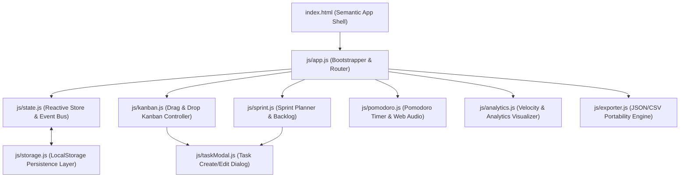

# ⚡ TaskForge OS — Developer Productivity Workstation & Kanban

[](https://developer.mozilla.org/en-US/docs/Web/JavaScript)
[](https://www.w3.org/TR/css-variables/)
[](#architecture)
[](LICENSE)

> A high-performance, local-first developer workstation featuring a **Drag-and-Drop Kanban Board**, **Sprint Planner & Backlog**, **Integrated Pomodoro Focus Timer**, and **Productivity Velocity Analytics**.

---

## 🌟 Key Workstation Capabilities

### 1. 📋 Drag-and-Drop Kanban Board
- Native HTML5 Drag and Drop API with smooth reordering and drop indicator zones.
- Customizable lifecycle columns (`Backlog`, `In Progress`, `Code Review`, `Completed`) with configurable WIP (Work In Progress) limit thresholds.
- Rich task cards featuring priority indicators (`🔥 Urgent`, `⚡ High`, `🟡 Medium`, `🟢 Low`), label chips, subtasks checklist progress bars, and overdue warnings.
- Native `<dialog closedby="any">` task modal with subtasks checklist and multi-label tagging.

### 2. 🏃 Sprint Planner & Product Backlog
- Manage multi-week software delivery sprints with dedicated start/end dates and sprint goals.
- Real-time sprint completion velocity tracking (`X / Y tasks closed`).
- Drag-free backlog partition: seamlessly shift tasks between the unassigned product backlog and the active sprint.

### 3. ⏱️ Integrated Pomodoro Focus Timer
- Integrated productivity timer supporting **Deep Focus (25m)**, **Short Break (5m)**, and **Long Break (15m)** modes.
- Circular SVG progress ring visualization with responsive countdown digits.
- **Synthesized Web Audio API Chimes**: Generates gentle dual-tone harmonic audio chimes on completion without relying on external mp3 assets.
- Session linking: associate focused intervals directly with specific sprint tasks.

### 4. 📊 Engineering Velocity & Analytics
- Live visual analytics dashboard calculating:
  - **Completion Rate (%)** and closed task throughput.
  - **Work In Progress (WIP)** load across pipeline columns.
  - **Committed Scope (Hours)** vs Burnt Hours.
  - **Priority Breakdown**: Percentage distribution bars across urgency classes.
- Zero external charting bloat: rendered entirely via lightweight CSS custom property bars and SVG.

### 5. 💾 Local-First Data Engine & Portability
- 100% offline-capable: runs instantly in any browser without requiring node servers, cloud subscriptions, or databases.
- Single-click **JSON Backup & Restore** for seamless cross-machine synchronization.
- **CSV Spreadsheet Export** for reporting in Excel, Google Sheets, or Notion.

---

## 🏛️ System Architecture



---

## ⌨️ Global Keyboard Shortcuts

| Shortcut | Action |
| :--- | :--- |
| <kbd>N</kbd> | Open New Task modal |
| <kbd>Ctrl</kbd> + <kbd>K</kbd> | Focus global task & tag search |
| <kbd>1</kbd> | Switch to Kanban Board view |
| <kbd>2</kbd> | Switch to Sprint Planner view |
| <kbd>3</kbd> | Switch to Pomodoro Timer view |
| <kbd>4</kbd> | Switch to Analytics view |
| <kbd>?</kbd> | Show Keyboard Shortcuts cheat sheet |
| <kbd>Esc</kbd> | Dismiss active dialog / blur search |

---

## 💻 Getting Started

### 1. Clone or Download Repository
```bash
git clone https://github.com/atikurrahmanxm/taskforge-os.git
cd taskforge-os
```

### 2. Launch Workstation
- Open **`index.html`** in any modern web browser (Chrome, Firefox, Safari, Edge).
- Or run with any lightweight static HTTP server:
  ```bash
  npx serve .
  ```

---

## 🛠️ Tech Stack & Architectural Principles

- **Vanilla JavaScript (ES6+ Modules)**: Modern decoupled architecture with native ES Modules, Pub/Sub event bus, and zero third-party dependencies.
- **Modern CSS3 Design System**: CSS Custom Properties for seamless dark/light theme switching, glassmorphic card overlays, and smooth CSS-based data visualizations.
- **HTML5 Native APIs**: Full implementation of the native HTML5 Drag and Drop API and accessible `<dialog>` modals with backdrop blur.
- **Web Audio API**: Real-time synthesized harmonic chimes for timer alerts without external asset requests.
- **Local-First Reliability**: Instant offline capability, responsive client-side persistence, and manual JSON/CSV data portability.

---

## 📄 License

This project is licensed under the [MIT License](LICENSE).
